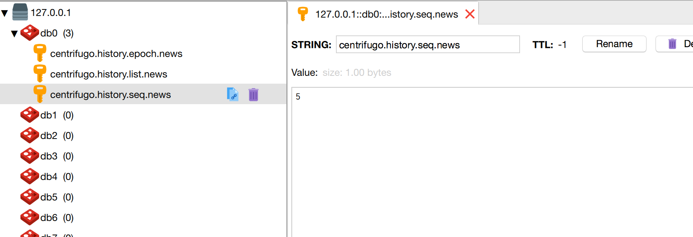

## centrifugo docker-compose demo

## how to running

* start centrifugo server

```code
docker-compose up -d
```

* init nodejs app

```code
yarn
yarn s
```

* publish some message

```code
curl -X POST \
  http://localhost:8000/api \
  -H 'Authorization: apikey cbf46e80-3e00-4642-8f3a-369b8707304d' \
  -d '{
    "method": "publish",
    "params": {
        "channel": "news",
        "data": {
            "text": "dalongrong"
        }
    }
}'
```

* sub message

```code
yarn run v1.17.3
$ node app.js
{ seq: 6, data: { text: 'dalongrong' } }
```

## some images

